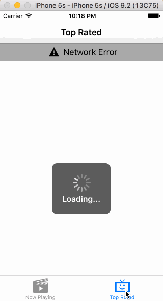

# Project 1 - *MOVIES*

**MOVIES** is a movies app using the [The Movie Database API](http://docs.themoviedb.apiary.io/#).

Time spent: **15** hours spent in total

## User Stories

The following **required** functionality is completed:

-  User can view a list of movies currently playing in theaters. Poster images load asynchronously.
  - Used AFNetworking to asynchronously load data and SwiftyJSON for easier Json parsing
-  User can view movie details by tapping on a cell.
-  User sees loading state while waiting for the API.
-  User sees an error message when there is a network error.
-  User can pull to refresh the movie list.

The following **optional** features are implemented:

- Add a tab bar for **Now Playing** and **Top Rated** movies.
- Implement segmented control to switch between list view and grid view 
      - Added a NavigationItem Button to switch between collection view and table view 
- Add a search bar.
- Customize the navigation bar.

The following **enhancements** can be done:

-  Sort the movies by language
-  Add 'Favorite' option to save movies for later
-  Have the option to navigate to a third party site to buy tickets 

## Video Walkthrough

Here's a walkthrough of implemented user stories:

Network Error :

One more walkthrough : 

GIF created with [LiceCap](http://www.cockos.com/licecap/).

## Notes

- Would like to more effectively reuse code and UI elements 
- Had some trouble making the views look petty 

